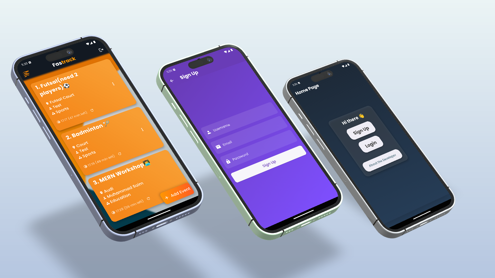

# FasTrack - Your Go-to Social App


Welcome to FasTrack, your ultimate social app for spontaneous campus events! This project leverages the power of Flutter Dart and Supabase to provide a seamless cross-platform experience with robust backend support.

## Features

- **Real-time Updates:** Stay informed about the latest campus events.
- **Secure Authentication:** User data is protected with secure authentication methods.
- **User-Friendly Interface:** Enjoy an intuitive and visually appealing interface.
- **Cross-Platform Compatibility:** Available for both Android and iOS devices.

## Screenshots



## Developer

Developed by Muhammad Saim.

### Connect with Me
[LinkedIn](https://linkedin.com/in/contactsaim)

## Download

Click the button below to download the APK (25MB):

[](app.apk)

## Technologies Used in App

- **Frontend:** Flutter Dart
- **Backend:** Supabase

## Technologies Used in Website

- **Frontend:** HTML CSS JS
- **Backend:** N/A
- **Styling:** Custom CSS with animations and responsive design


## Installation

1. Clone the repository:
    ```sh
    git clone https://github.com/saim-x/fastrack.git
    ```
2. Navigate to the project directory:
    ```sh
    cd fastrack
    ```
3. Install dependencies:
    ```sh
    flutter pub get
    ```
4. Run the app:
    ```sh
    flutter run
    ```

## Contributing

Contributions are welcome! Please fork the repository and create a pull request to propose changes.

## License

This project is licensed under the MIT License. See the [LICENSE](LICENSE) file for details.

---

Thank you for checking out FasTrack! If you have any questions or feedback, feel free to reach out through my [GitHub](https://github.com/saim-x) or [LinkedIn](https://linkedin.com/in/contactsaim) profiles.

Happy event tracking! 🚀
